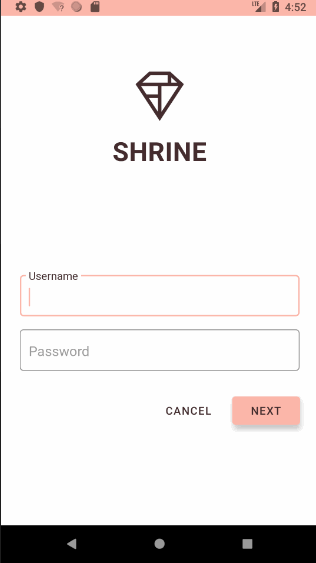
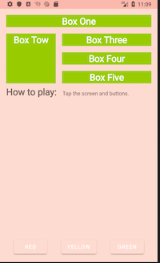

# Google MDC Codelab

Practice MDC with kotlin from [MDC Developer Tutorial](https://material.io/collections/developer-tutorials/#)

Demo:

## Notes

### MDC 1010

MDC 101 中 MaterialButton 是新的 component，以前没用过，TextInputLayout 和 TextInputEditText 是以前就知道的。

纯文字的按钮：

    <android.support.design.button.MaterialButton
        android:layout_marginRight="12dp"
        style="@style/Widget.MaterialComponents.Button.TextButton"
        android:layout_toStartOf="@id/next_button"
        android:layout_toLeftOf="@id/next_button"
        android:text="@string/shr_button_cancel"
        android:layout_width="wrap_content"
        android:layout_height="wrap_content" />

使用了 design 库自带的样式 "@style/Widget.MaterialComponents.Button.TextButton"，样式没有前缀，比如 "@android:style/..."

应用主题：

    <!-- Base application theme. -->
    

浅色主题，而且没有 ActionBar。

继承自 "Theme.MaterialComponents.Light.NoActionBar"，注意也没有前缀 "@android:style/..."，因为这也是来自 design 库，而不是系统 SDK。(如果要兼容以前版本的话，应该是用 "Theme.AppCompat.Light.NoActionBar" 吧。)

### MDC 102

用 RecyclerView，GridLayoutManager，CardView 实现 ProductList。

CardView 现在已被 android.support.design.card.MaterialCardView 取代。

说实话，Adapter 和 ViewHolder 真心设计得不好，ViewHolder 只持有 view，却不知道此 view 对应的 layout，view 对应的 layout 只有 Adapter 知道。我觉得 view 对应的 layout 就该放在 ViewHolder 中。

### MDC 103

修改样式和主题还是很迷糊

### MDC 104

添加背景菜单，这个设计很有意思，让菜单隐藏在主内容之下。添加动效让主页内容下滑显示出菜单。

### More

从 [Getting started with Material Components for Android](https://material.io/develop/android/docs/getting-started/) 一文得知，从 support 库 28.0.0 起，其中 design 包中组件将迁移到 'com.google.android.material:material:1.0.0' 库中，当然 'com.android.support:design:28.0.0' 也还可以继续使用，但未来的趋势是使用前者。

support 库中的其它包将迁移到 androidx 库中，比如 cardview, recyclerview, constraintlayout...

原来：

    api 'com.android.support:design:28.0.0-alpha3'
    implementation 'com.android.support:support-v4:28.0.0-alpha3'
    implementation 'com.android.support.constraint:constraint-layout:1.1.2'

现在：

    implementation 'com.google.android.material:material:' + rootProject.materialVersion
    implementation 'androidx.appcompat:appcompat:' + rootProject.appCompatVersion
    implementation 'androidx.cardview:cardview:' + rootProject.cardViewVersion
    implementation 'androidx.recyclerview:recyclerview:' + rootProject.recyclerVersion
    implementation 'androidx.constraintlayout:constraintlayout:' + rootProject.constraintLayoutVersion

使用新库后，组件的包名就发生了变化，比如 TextInputLayout 就从 android.support.design.widget.TextInputLayout 变成了 com.google.android.material.textfield.TextInputLayout。

anyway，忘记 support 库，以后就用 material 库和 androidx 库吧。

APP 主题将不再继承自 Theme.AppCompat...，而是 Theme.MaterialComponents...，比如：

    Theme.MaterialComponents
    Theme.MaterialComponents.NoActionBar
    Theme.MaterialComponents.Light
    Theme.MaterialComponents.Light.NoActionBar
    Theme.MaterialComponents.Light.DarkActionBar

没有显式用 Light 说明的主题默认是 Dark 配色。

如果我们对 APP 使用 Theme.MaterialComponents.Light 主题，则 Toolbar 也会是浅色配色，但很多人会喜欢在 Light 主题中使用深色配色的 Toolbar (或 AppBarLayout)，这就是为什么这时我们需要额外再给 Toolbar 再配置一个深色主题。给 Toolbar 配置深色主题后，其弹出的 action menu 也会是深色主题，而对于 action menu 我们希望是浅色配色，这就是为什么对于 Toolbar 来说，它即有 `android:theme` 属性，又有 `app:popupTheme` 属性。

从以前的一篇老文 [Android Design Support Library 的 代码实验——几行代码，让你的 APP 变得花俏](https://www.jianshu.com/p/1078568e859f) 理解，为什么我们需要使用新的 CoordinatorLayout，用 AppBarLayout 包裹 Toolbar，或者 AppBarLayout 包裹 CollapsingToolbarLayout，再由 CollapsingToolbarLayout 包裹 Toolbar，用 NestedScrollView 替代 ScrollView。

起因是 FAB 和 Snackbar 在原来的 LinearLayout 中无法协同合作，因此我们用 CoordinatorLayout 作为 root layout，使其中的 views 可以协同合作，在 CoordinatorLayout 中，Toolbar 和 ScrollView 都不是设计来直接和 CoordinatorLayout 配合使用，所以要用 NestedScrollView 替换 ScrollView，用 AppBarLayout 包裹 Toolbar，以前的 ListView 也不能在 CoordinatorLayout 中使用，但 RecyclerView 可以。

CoordinatorLayout 的 behavior 还需要深入学习一下。

常见 Material Design 组件：

- FAB
- SnackBar
- CoordinatorLayout
- Toolbar
- AppBarLayout
- TabLayout
- NestedScrollView
- CollapsingToolbarLayout
- Navigation Drawer & NavigationView
- TextInputLayout & TextInputEditText

CardView 不在 design 包里，在一个独立的 cardview 包中，recyclerview 也是。

后面 Google 还陆续添加了 MaterialButton，BottomNavigationView，Chip 等组件。

## Theme & Style

- [When should one use Theme.AppCompat vs ThemeOverlay.AppCompat?](https://stackoverflow.com/questions/27238433/when-should-one-use-theme-appcompat-vs-themeoverlay-appcompat)
- [Theme vs Style](https://chris.banes.me/2014/11/12/theme-vs-style/)
- [appcompat v21: material design for pre-Lollipop devices!](https://chris.banes.me/2014/10/17/appcompat-v21/)
- [Android Theme.AppCompat 中，你应该熟悉的颜色属性](http://yifeng.studio/2017/04/18/android-theme-appcompat-color-attrs/)
- [Theming with AppCompat](https://medium.com/androiddevelopers/theming-with-appcompat-1a292b754b35)

`android:background="?attr/colorPrimary"`，`?attr/colorPrimary`，用 `?` 开头，表示引用此 project 中属性为 colorPrimary 的 item 的值。

从上述文章可以得知，有些 view 的属性必须定义到到 theme 里面才能作用在 view 上，你直接把这个属性作用在 view 上是不起作用的。

虽然是说 Theme 是 global，View 自己的属性是 local，local 的属性会覆盖 global，但有很多属性 View 并不直接支持，只能写在 Theme 里面。如果某个 view 想使用与整个 APP 不同的 theme，那么可以在此 view 上使用 `android:theme` 属性，配置另一个 theme 来覆盖 APP 的 theme。

比如文中提到的 `android:colorEdgeEffect` 属性：

> As this is a theme attribute you can not just set it directly on the view. Instead we need to use  android:theme with a custom ThemeOverlay. Our custom overlay just sets  android:colorEdgeEffect to be red. We then set this theme on to the view so that it takes effect.

ThemeOverlay 是在相应的 Theme 主题上做了少许变化，主要作用于 Toolbar/AppBarLayout 或个别 view。

---

# Google ContraintLayout Codelab

[Kotlin Android Fundamentals 02.3: Constraint layout using the Layout Editor](https://codelabs.developers.google.com/codelabs/kotlin-android-training-constraint-layout/#0)

ContraintLayout 中的 baseline 对齐方式不知道在其它 Layout 中好实现不。

---

# Google Navigation Codelab

[Navigation Codelab](https://codelabs.developers.google.com/codelabs/android-navigation/#0)

整体思想是和 iOS 的 Storyboard 类似的，navigation 中的 action 就类似 Storyboard 中的 segue。

NavHostFragment 是 navigation 的容器。

在容器之外的组件，比如 Toolbar，NavigationView，需要一些额外的 API 和 navigation 关联起来。
