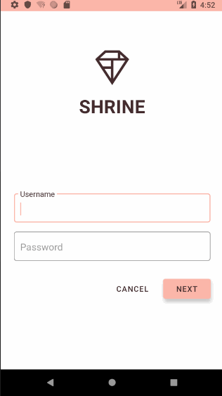

# Google MDC Codelab

Practice MDC with kotlin from [MDC Developer Tutorial](https://material.io/collections/developer-tutorials/#)

Demo:

## Notes

### MDC 1010

MDC 101 中 MaterialButton 是新的 component，以前没用过，TextInputLayout 和 TextInputEditText 是以前就知道的。

纯文字的按钮：

    <android.support.design.button.MaterialButton
        android:layout_marginRight="12dp"
        style="@style/Widget.MaterialComponents.Button.TextButton"
        android:layout_toStartOf="@id/next_button"
        android:layout_toLeftOf="@id/next_button"
        android:text="@string/shr_button_cancel"
        android:layout_width="wrap_content"
        android:layout_height="wrap_content" />

使用了 design 库自带的样式 "@style/Widget.MaterialComponents.Button.TextButton"，样式没有前缀，比如 "@android:style/..."

应用主题：

    <!-- Base application theme. -->
    

浅色主题，而且没有 ActionBar。

继承自 "Theme.MaterialComponents.Light.NoActionBar"，注意也没有前缀 "@android:style/..."，因为这也是来自 design 库，而不是系统 SDK。(如果要兼容以前版本的话，应该是用 "Theme.AppCompat.Light.NoActionBar" 吧。)

### MDC 102

用 RecyclerView，GridLayoutManager，CardView 实现 ProductList。

CardView 现在已被 android.support.design.card.MaterialCardView 取代。

说实话，Adapter 和 ViewHolder 真心设计得不好，ViewHolder 只持有 view，却不知道此 view 对应的 layout，view 对应的 layout 只有 Adapter 知道。我觉得 view 对应的 layout 就该放在 ViewHolder 中。

### MDC 103

修改样式和主题还是很迷糊

### MDC 104

添加背景菜单，这个设计很有意思，让菜单隐藏在主内容之下。添加动效让主页内容下滑显示出菜单。
